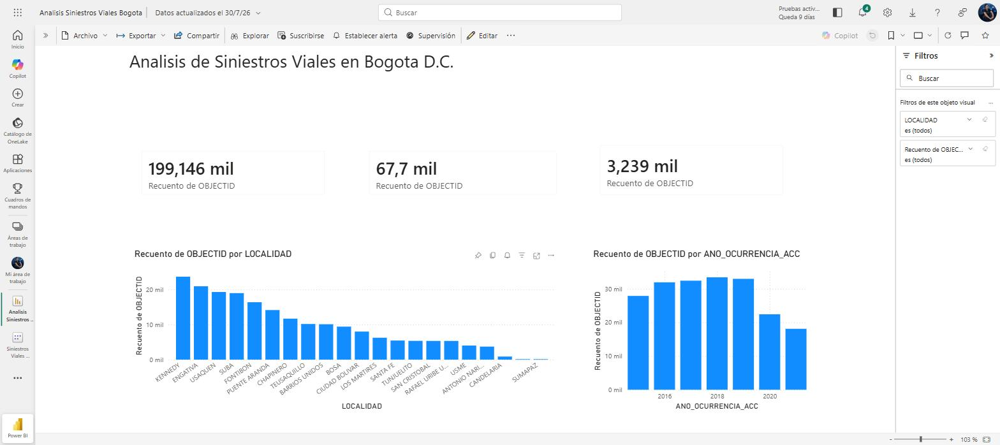
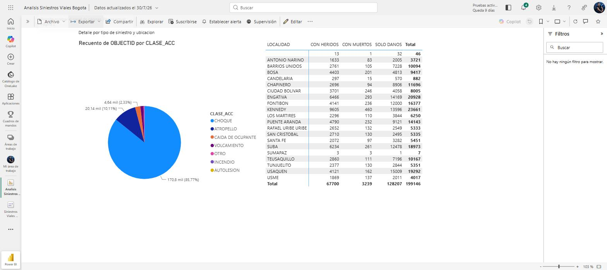

# Modelo Power BI de KPIs Comerciales

## Problema
Los equipos comerciales necesitan un dashboard confiable para monitorear ventas, ticket promedio y crecimiento por categoria y canal, con un modelo de datos bien disenado (no una hoja de calculo con formulas sueltas) que sea facil de mantener y de escalar.

## Solucion
Este repositorio documenta un modelo de datos en esquema estrella y un conjunto de medidas DAX para construir ese dashboard en Power BI, usando datos ficticios de un e-commerce (clientes, productos y ventas). Incluye los CSV de origen, las medidas DAX documentadas y la explicacion completa del modelo, para que el dashboard pueda reconstruirse de forma identica en Power BI Desktop.

**Nota importante:** Power BI Desktop es una aplicacion de escritorio y no puede operarse ni generarse un archivo .pbix desde el navegador. Por eso este repositorio no incluye un .pbix; en su lugar documenta todo lo necesario (datos, modelo y medidas) para que cualquiera pueda reconstruir el dashboard localmente siguiendo la guia de abajo.

Los datos utilizados son completamente ficticios y fueron creados unicamente con fines demostrativos.

## Tecnologias
- Power BI Desktop
- DAX (Data Analysis Expressions)
- Power Query (para la carga e importacion de los CSV)

## Estructura del repositorio
```
modelo-powerbi-kpis-comerciales/
├── README.md
├── data/
│   ├── clientes.csv
│   ├── productos.csv
│   └── ventas.csv
├── dax/
│   └── medidas.dax
└── docs/
    └── modelo_datos.md
```

## Como reconstruir el dashboard (paso a paso)
1. Abrir Power BI Desktop y seleccionar **Obtener datos > Texto/CSV**.
2. Importar los tres archivos de `data/`: `clientes.csv`, `productos.csv` y `ventas.csv`.
3. En la vista de **Modelado**, crear las relaciones:
   - `ventas[id_cliente]` -> `clientes[id_cliente]`
   - `ventas[id_producto]` -> `productos[id_producto]`
4. Crear la tabla `Calendario` con la formula DAX incluida en `dax/medidas.dax` (Modelado > Nueva tabla) y relacionarla con `ventas[fecha]`.
5. Copiar cada medida de `dax/medidas.dax` en una tabla de medidas dentro del modelo (Modelado > Nueva medida).
6. Construir las visualizaciones: tarjetas para Ventas Totales, Ticket Promedio y Clientes Activos; un grafico de lineas de Ventas Totales por mes; un grafico de barras de Participacion por Categoria; y una tabla de Clientes con Mas de una Compra.
7. Aplicar segmentadores (slicers) por canal, categoria y rango de fechas.

Para el detalle completo del modelo de datos (tablas, columnas y relaciones) ver [docs/modelo_datos.md](docs/modelo_datos.md).

## Resultado
Un dashboard de KPIs comerciales con visibilidad de ventas totales, ticket promedio, crecimiento interanual y participacion por categoria, construido sobre un modelo de datos limpio y documentado.

_(Espacio para captura de pantalla del dashboard una vez construido en Power BI Desktop)_


---

## Actualizacion: Dashboard Real Publicado (Power BI Service)

Ademas del modelo documentado arriba (con datos ficticios, pensado para reconstruirse en Power BI Desktop), este proyecto ahora incluye un dashboard real, construido y publicado en Power BI Service, conectado a datos abiertos oficiales.

### Fuente de datos

Dataset: Historico de Siniestros Viales de Bogota D.C. Entidad: Secretaria Distrital de Movilidad. Portal: datos.gov.co (datos abiertos de Bogota). Licencia: Creative Commons Atribucion (CC BY 4.0). Metodo de conexion: Power BI Service, conector API web, apuntando directamente al CSV publico, sin necesidad de descarga manual.

### Contenido del dashboard (2 paginas)

Pagina 1, resumen general: tarjetas KPI con el total de siniestros y el desglose por gravedad, ademas de graficos de barras por localidad y por ano de ocurrencia. Total de siniestros: 199,146. Con heridos: 67,700. Con muertos: 3,239. Solo danos: 128,207.

Pagina 2, detalle por tipo y ubicacion: grafico circular de participacion por clase de siniestro (choque, atropello, volcamiento, entre otros) y una matriz cruzando localidad por gravedad con totales.

### Capturas de pantalla





### Por que se hizo asi

Power BI Desktop no puede ejecutarse en un navegador, pero Power BI Service si permite crear modelos, medidas y reportes completos desde la web conectandose a fuentes de datos publicas via API. Esto permitio construir un dashboard end-to-end con datos reales y publicarlo, complementando la documentacion tecnica del modelo ficticio de la seccion anterior.
